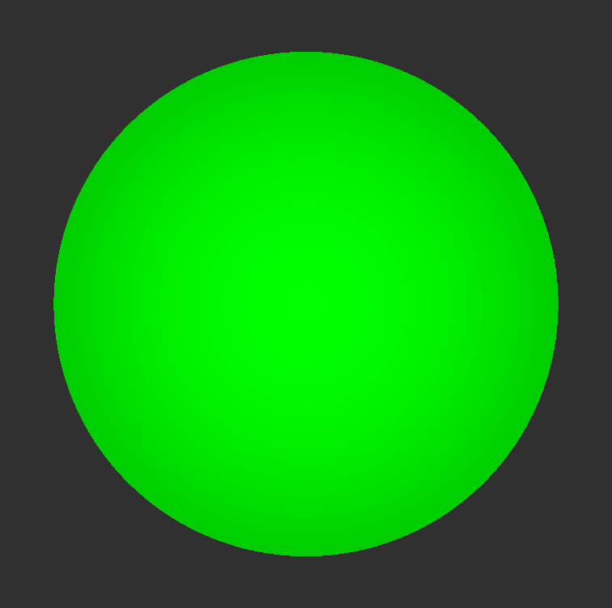
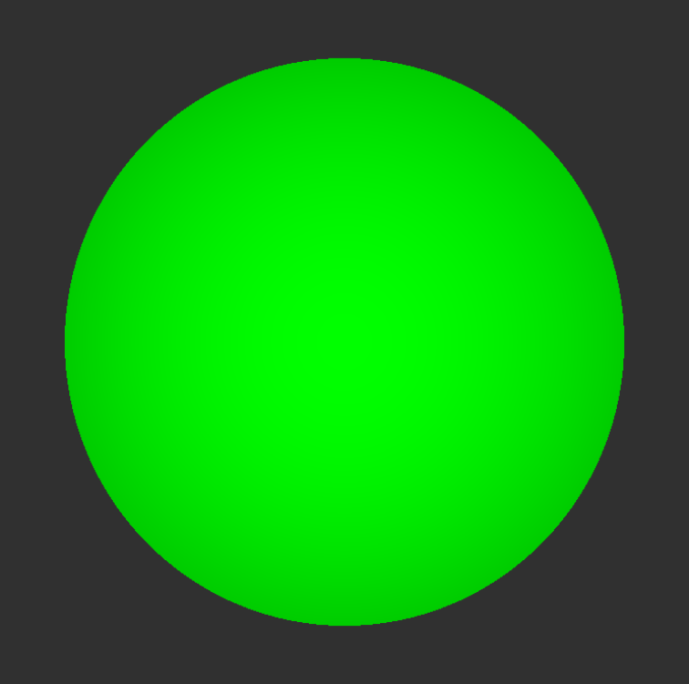
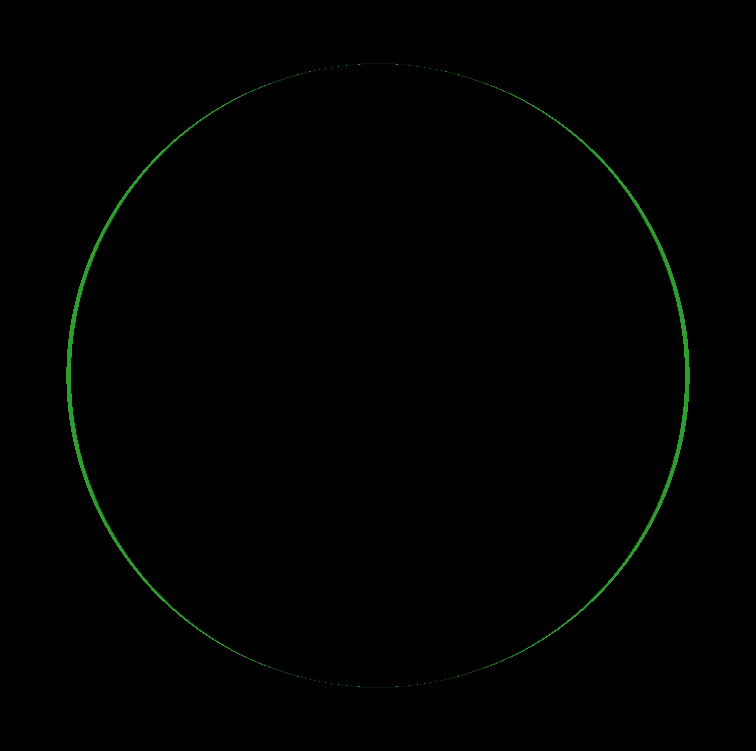

# RViz 3D Visual Testing Framework

This testing framework allows users to take screenshots of the main 3D scene and/or secondary render windows, and to compare them with previously captured reference screenshots.

## Assumptions and Settings

- The package `rviz_visual_testing_framework` provides a library which allows users to write visual tests in any desired rviz package (e.g. rviz_default_plugins).

- Being `rviz_package/` the source folder of the rviz package where the tests are written, the reference screenshots will be located in `rviz_package/test/reference_images`.
The test images will be, instead, saved in the corresponding build folder, in a directory called: `test_images`.
Both directories, if not already existing, will be generated at build time.

- The purpose of this framework is to have visual *smoke* tests serving as regression tests.

- The user will be able to do both of the following: either take/update reference images, or take test images and compare them with existing references.

- By default the comparison will be performed pixelwise.
In case of non identical pictures, the difference image will be generated (the color value of each pixel of such image is the absolute value of the difference between the respective pixels of the test and the reference images).
At this point the MSE (Mean Square Error) index is calculated using the difference image and compared to a threshold value that the user can set.
If the computed MSE index is lower than this threshold, then the test will pass, otherwise it will fail.
In both cases the user will be notified about the actual value of the MSE index.
In the future, a more sophisticated comparison method may be provided.

- The dimensions of the different render windows are not fixed by RViz' config.
Therefore screenshots will be different on different systems.
To compensate for this, test images have to be resized.
This is done in the same way that RViz resizes render windows: Vertical resizing is done by resizing the image keeping proportions, while horizontal resizing is cropping the image equally on the left and right.
This ensures maximum compatibility between the test image and the reference image.
To ensure that such resizing is always possible, test images are a lot wider than reference images.

## Interface

For RViz itself: the CMake flag `EnableVisualTests` is provided to enable visual tests:

        colcon build --cmake-args -DEnableVisualTests=True -DBUILD_TESTING=1

This will build the tests. Afterwards run

        colcon test 
      
to execute the tests and the screenshots will be compared to the existing reference images.

Furthermore, the reference images can be updated by running the tests after setting the environmental variable `GenerateReferenceImages` to `True`.
    
**NB**: the `EnableVisualTests` flag value is automatically cached by CMake, meaning that if it's not specified, the value used for the last run will be used.

As anticipated above, if the tests run, by default each test will succeed if both the test images and the relative reference images exist and they are within an MSE threshold.
It will fail if either the two sets of images exist but they are not identical or within this threshold, or if at least one of the reference images does not exist.

By default, the images are named after the test they belong to.
In particular the reference image relative to the main render window will be called `<test_name>_ref.png` and the corresponding test image will be `<test_name>.png`.
For what concerns the secondary windows, they will be named similarly: `<test_name>_secondary_window#_ref.png` and `<test_name>_secondary_window#.png`, where `#` is the number of the secondary window.
These names can be changed by providing the desired name as an argument to the capture methods (i.e. `captureRenderWindow()`, `captureMainWindow()` or `assertMainWindowIdentity()`).

Given that we want reference images to be provided to the user in the source directory, it is important for the tests to be stable when it comes to comparing screenshots taken on different machines.
If the images are taken on different screens, in fact, they will almost certainly not be pixelwise identical, so that the pixel-by-pixel comparison will fail even if the test should pass.
For the moment this issue is addressed by computing the MSE (Mean Square Error) for the two pictures and comparing it to a threshold value that can be set by the user (by default it is equal to 0.01, to take in account small fluctuations due to different screens).
**NB**: the MSE is a value between 0 (if the images are identical) and 1 (if the difference image is completely white, which would happen if for each pixel the color difference is equal to 1 - i.e. maximal: each channel of an `Ogre::ColorValue` is between 0 and 1 - for every channel).
If the computed MSE is found to be bigger than the set threshold, then the test will fail, otherwise it will pass.

As said, the user can specify a different threshold value for each test, should the default value of 0.01 not be the optimal one.
This is done via the `VisualTestFixture` method `setTesterThreshold(double threshold)`, which can easily be called directly in the tests (before calling one of the comparison methods).

Because of the heuristic nature of this method, the appropriate threshold value will depend on the single test and on the context.

## GUI interaction

In order to be able to set the scene in the desired way before taking the screenshots (e.g. add one or more displays, modify their properties, etc.), one would like to be able to automatise the interaction with the RViz GUI.
In the future, on top of being the most sensible and effective way to prepare the 3D scene for the visual tests, this functionality may also allow pure GUI tests.
This can be achieved with the help of the QTest framework.
So far the Visual Testing framework offers the possibility to add and interact with most of the available displays (Grid, PointCloud, Camera, Image and Polygon).
The addition of displays in the future is made straightforward by the use of a base class from which all display page objects derive:

- The class `BasePageObject` is provided, as the base class for every display page object.
It implements all the basic methods to modify the various kind of display properties (QString, boolean, QComboBox, etc.);

- For each display, a class `<DisplayName>DisplayPageObject` - which inherits from `BasePageObject` - exists, and it implements the specialised methods to interact with the specific properties of the relative displays;

- We also provide a `DisplayHandler` class, which has methods to add displays to the scene and to remove them;

- We provide a test environment, in the form of a TestFixture which offers all the relevant functionality for the tests (see paragraph below).

## Writing tests

### Additions to the CMakeLists.txt file

In order for visual tests to work correctly, some additions need to be made to the `CMakeLists.txt` file of the rviz package where the tests are written.
Specifically, the following code must be added:

    option(EnableVisualTests "decides whether or not to enable the tests")

    add_definitions(-D_BUILD_DIR_PATH="${CMAKE_CURRENT_BINARY_DIR}")
    add_definitions(-D_SRC_DIR_PATH="${CMAKE_CURRENT_SOURCE_DIR}")

    file(MAKE_DIRECTORY ${CMAKE_CURRENT_BINARY_DIR}/test_images)
    file(MAKE_DIRECTORY ${CMAKE_CURRENT_SOURCE_DIR}/test/reference_images)

which has the following purpose:

- the line `option(EnableVisualTests "decides whether or not enable the tests")` allows us to use the CMake flag `EnableVisualTests` to decide whether or not the visual tests will run.
In particular, for this mechanism to work, we also need to wrap the `ament_add_gtest(visual_test [...])` block in an `if(EnableVisualTests STREQUAL "True")` condition.

- the second and third line are used to code the path to the build and source directories of the current rviz package. These paths are then passed to the testing framework via the test fixture.

- finally, the last two lines generate the directories where the test images and the reference ones are saved, should they not be already existing.

Moreover, should it not already be present, the following should also be included:

    find_package(Qt5 REQUIRED COMPONENTS Widgets Test)

### How to write a test

An example of how tests are written and how they work is provided by the `pointcloud_visual_test.cpp` file in `rviz_default_plugins/test/visual_tests` or in the [quick start guide](README.md).
In the following the most important points with respect to the tests are summarized:

* As said, the `VisualTestFixture` offers convenience methods to:
    * add a new display: `addDisplay<display type>()`, which creates an instance of the desired page object and returns a shared pointer to it;
    * remove a display: `removeDisplay(std::shared_ptr<BasePageObject> display)`;
    * capture a screen shot of the main render window: `captureMainWindow()` or of a secondary window: `captureRenderWindow(std::shared_ptr<PageObjectWithWindow> display)`;
    * assert the identity of test and reference images: `assertScreenShotsIdentity()`;
    * both take a screenshot of the main render window and assert its identity to the reference image (which can be used if one is not interested in secondary windows): `assertMainWindowIdentity()`;
    * set the position of the camera and its sight vector: `setCamPose(Ogre::Vector3 pose)` and `setCamLookAt(Ogre::Vector3 look_at)`;
    * change the MSE threshold value: `setTesterThreshold(double threshold)`.

- A custom RViz configuration is loaded right after the application starts.
It corresponds to an empty scene, with the help panel hidden.

- In writing the test it is important to take care that the display property that one wants to change is visible when the relative display menu is expanded.
That means that there must be enough free place in the display panel so that when the display is expanded the desired property row is still visible on screen.
This is because, in order to set properties, mouse events (in particular mouse clicks) are simulated by `QTest`, and if the point we want to click on is not visible on screen, then the simulated mouse click will fail (or, rather, the clicked screen area won't correspond to the desired one).
Note that displays menus are automatically expanded before a property is changed.
On the other hand, in order to collapse them, one can use the `BasePageObject` class method `collapse()`.

- For reasons that will become clear later, in each test one and only one of the two methods `assertScreenShotsIdentity()` and `assertMainWindowIdentity()` must be called.
After such call, interaction with RViz is no longer possible for the current test, and any attempt to interact with the GUI from this point on will not produce the expected behaviour and will possibly result in a segfault.

- At the end of each test, the scene is cleaned, the application reset and all the present displays removed, before the following test begins.

### How to write tests for custom displays

In order to write tests for new displays that do not yet have a page object, it needs to be written.
Everything else works as described in the previous display. To write a page object:

- Derive from the class BasePageObject. You need to pass the display name and its group (the group is defined in the addDisplay dialog, if it is not `rviz_default_plugins`, this needs to be found out manually).

- Implement methods to set all properties. Call the methods provided in BasePageObject (e.g. `setFloat` for FloatProperties), giving the name of the corresponding property and, if necessary a vector of parent properties.

- Note: When several subproperties have the same name, only the first property will be found by the algorithms in BasePageObject.

### How to have stable tests

As already anticipated above, visual tests are very sensitive to the the machine (graphic card, screen, settings, etc.) on which they run.
Screenshots taken on different screens will in general not be pixelwise identical, so that a pixel-by-pixel comparison will result in a failure of the test, even though it should pass.
For the moment this issue is addressed by computing the MSE index between test and reference image and comparing it to a threshold value that can be set by the user.
This tool can be used to obtain robust tests which are sufficiently stable with respect to the machine they run on.
In order to do so, keep in mind the following points:

- the tests are not effective when it comes to small details, e.g. taking the case of a pointcloud, a test won't be able to consistently detect the presence (or absence) of small points in the scene, or of other small objects which may or may not be rendered.
Each test, therefore, has to concentrate on a few (at best just one) rendered objects, which have to almost fill the scene.

- as a consequence, it is suggested to write test cases that examine the presence and the aspect of big objects, possibly centered in the scene and occupying most of it.
For example, if the goal of the current test is to check that pointclouds are rendered correctly, then the camera and the pointcloud have to be set so that this fills most of the scene, all other details being irrelevant;

- choose the MSE index threshold wisely and adjust its value according to the context and goals.
For now, the suggestion is to write test which would generate an MSE value of around 0.1 or greater in case of failure (i.e. the object is not rendered, it has a wrong color, etc).
With this goal in mind, the default MSE threshold has been set to 0.01, one order of magnitude lower than the failing one and bigger than the expected fluctuations due to differences in the systems.
This should result in robust and stable tests.

As an example, let's take a look at the following images: 

  
  
  

They correspond to a test for the PointCloud display, in which one big green sphere point is 
rendered in the center of the scene.
The first image is the reference screenshot, the second one is the test image, taken on a different machine.
Finally, the third picture is the image difference, which shows that the two screenshots, even though they look identical, have actually quite a few different pixels.
For this set of images, the MSE index is ~0.0011, which is lower than the chosen default value of 0.01, and two orders of magnitude smaller than the failing reference value of ~0.1.
For reference, if the test image for this test didn't show any sphere (i.e. the pointcloud is not rendered in the scene), then the MSE would be slightly bigger than 0.1.
If, instead, the color were wrong, then the MSE would be approximately between 0.05 (slightly different shade of green) and 0.44 (white sphere in the difference image).

## How tests work

Given their nature, the visual tests need a running instance of RViz in order to work.
This means that one needs to have an instance of an `rviz_common::VisualizerApp` and one of an associated `QApplication`.
The QApplication must then be started and all the interactions with the application must be performed while the QApplication is in the main event loop.
Unfortunately, the method `QApplication::exec()`, called to start RViz, will not return until the QApplication is quit, making it impossible to interact with the application in a straightforward way from within the same thread.
Trying to access the QApplication from a different thread is also not viable, due to Qt constraints.

A solution to this problem is provided by the method `QTimer::singleShot(int delay, QObject * context, Func1 slot)`, which registers the function `slot` (either a Q_SLOT or a lambda) to be performed after the amount of time specified by `delay`.
If `QTimer::singleShot()` is called before `QApplication::exec()` and a proper delay is specified, then the the action registered by it will take place while the QApplication is still in the main event loop, making it possible to interact with RViz.

This mechanism is used in this framework to make the visual tests possible.
In particular, the class `Executor` takes care of registering with an appropriate delay all the desired actions specified in the tests, so that the user does not have to worry about it.

As said, RViz is started by calling `QApplication::exec()`.
This is done internally by the VisualTestFixture methods which perform the comparison between screenshots (i.e. `assertScreenShotsIdentity()` and `assertMainWindowIdentity()`).
For this reason, one of these methods MUST be called in each test and that must be done only at the end of it.
In particular, only one of them can be called in one test: `assertScreenShotsIdentity()` is used if one is
interested also (or only) in secondary render windows and, therefore, screenshots of both the 
main and secondary windows (or only of secondary windows) have been taken.
On the other hand `assertMainWindowIdentity()` can be used if only the main render window is of interest.
This method will, in fact, both capture a screenshot of the main render window and perform the image comparison.
Therefore, if the method `assertMainWindowIdentity()` is called, there is no need to use the method `captureMainWindow()` before.

## Test Fixture

As anticipated above, the test environment is provided in the form of a TestFixture, called `VisualTestFixture`.
Among its members, the fixture owns also an instance of `QApplication`, `VisualizerApp`, `DisplayHandler` and of `Executor`.
In this way, it can take care of all the tasks concerning the startup and shutdown of RViz itself, displays management and GUI interactions handling,
offering convenience methods for all that can be used in the tests to set the scene, add or delete a display, capture a screen shot of a render window and compare sets of images.  
